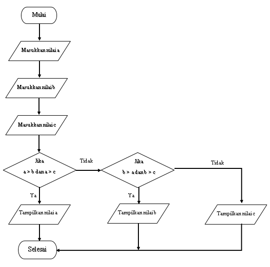

# TUGAS PRAKTIKUM 2

## SOAL

## JAWABAN
  - Buka text editor, seperti PyCharm, Visual Studio, Atom, dan lain-lain.
  - Kemudian salin kode berikut ini

        1   #program menampilkan angka terbesar dari 3 inputan
        2
        3   a = int(input("Masukkan nilai a: "))
        4   b = int(input("Masukkan nilai b: "))
        5   c = int(input("Masukkan nilai c: "))
        6
        7   if(a > b) and (a > c):
        8       print('Nilai a paling besar, yaitu', a)
        9   elif(b > a) and (b > c):
        10      print('Nilai b paling besar, yaitu', b)
        11  else:
        12      print('Nilai c paling besar, yaitu', c)
        13

  - Simpan dengan nama `labspy02.py`, Kemudian jalankan program tersebut. Maka akan menampilkan output sebagai berikut
  

    
    

  - Flowchart dari program tersebut

    
    

## PENJELASAN
  - Pada baris ke-3, menginstruksikan kita untuk memasukkan nilai **a**, kemudian akan disimpan dalam variabel `a` dalam bentuk integer.

  - Pada baris ke-4, menginstruksikan kita untuk memasukkan nilai **b**, kemudian akan disimpan dalam variabel `b` dalam bentuk integer.

  - Pada baris ke-5, menginstruksikan kita untuk memasukkan nilai **c**, kemudian akan disimpan dalam variabel `c` dalam bentuk integer.

  - Di baris ke-7, ada klausa `if` untuk pilihan kondisi pertama, dan `and` merupakan operasi logika, hasilnya adalah _True_ jika kedua operatornya bernilai benar. Misalnya

    - `a=5`,`b=1`,`c=3`, _"Jika nilai `a` lebih besar dari `b`"_ **(ini benar)**, dan _"Jika nilai `a` lebih besar dari `c`"_ **(ini benar)**. Maka program berlanjut ke baris-8, _cetak nilai `a` ke layar_.
    

        
        

  - Pada baris ke-9, ada klausa `elif` untuk pemilihan kondisi alternatif apabila `if` tidak terpenuhi. dan `and` merupakan operasi logika, hasilnya adalah _True_ jika kedua operatornya bernilai benar. Misalnya

    - `a=7`,`b=8`,`c=4`, _"Jika nilai `a` lebih besar dari `b`"_ **(ini salah)**, dan _"Jika nilai `a` lebih besar dari `c`"_ **(ini benar)**. Maka program loncat ke baris-9,

    -  _"Jika nilai `b` lebih besar dari `a`"_ **(ini benar)**, dan _"Jika nilai `b` lebih besar dari `c`"_ **(ini benar)**. Maka program berlanjut ke baris-10, _cetak nilai `b` ke layar_.

        

  - Pada baris ke-10, ada klausa `else` sebagai jalan akhir apabila klausa `if`, dan `elif` tidak terpenuhi. Misalnya

    - `a=2`,`b=4`,`c=7`, _"Jika nilai `a` lebih besar dari `b`"_ **(ini salah)**, dan _"Jika nilai `a` lebih besar dari `c`"_ **(ini salah)**. Maka program loncat ke baris-9,

    -  _"Jika nilai `b` lebih besar dari `a`"_ **(ini benar)**, dan _"Jika nilai `b` lebih besar dari `c`"_ **(ini salah)**. Maka program loncat ke baris-11, kemudian 12

    - _cetak nilai `c` ke layar_.
    

        
